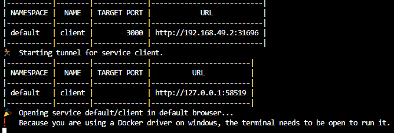
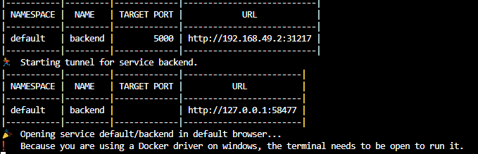

## HOW I TACKLED THIS WEEK's IP
Used previous dockerised project-https://github.com/rimash2/Yolomy.git clonned from https://github.com/Vinge1718/yolo.git
## Created Kubernetes Folder and created the following folders under Kubernetes.
## 1.Bakend
## 2.Client
## 3.Mongo
Under each folder listed above I created YAML files.
## Uses of YAML in Kubernetes
1.In Kubernetes, a YAML file serves several purposes. First, it helps to define the application service layout.
2.It also specifies the type of container image that should be used.
3.Additionally, it contains data about how many replicas to deploy.
4.Developers use YAML files in Kubernetes to indicate whether or not a load balancer should run behind a service.
5.It also stores information about the authorizations that connect to the container registry. YAML files offer an       information model that is more complete when compared to other languages.
## Deployment
Defines how an application should be deployed to Kubernetes helps with understanding which resources should be used and managed as a single unit. You can also mention the number of replicas and replica sets you want for your K8 pods. Here’s a sample code:
## Service
Describes how a set of pods can be exposed to the outside world it essentially help you see what kind of applications are running on what pods.
## Persistent Volumes
Describes storage that can be used by applications running in Kubernetes
## Config Maps
Used to store configuration information that can be used by applications or tools
## Secrets
Used to store sensitive information like passwords or certificates

## How to Add The Files To kuberntes Cluster
kubectl apply -f filename.yml

## How To Display the Client Side on the browser with the format ipaddress:port
First is to get the ip adress of the of kubernetes cluster
Command kubectl get node -o wide
This will prompt INTERNAL-IP of the minikube
It is this ip that get prepended to the nodePort declared as in client service
minikube service client

##  http://192.168.49.2:31696 

## How To Display the backend Side on the browser with the format ipaddress:port
First is to get the ip adress of the of kubernetes cluster
Command kubectl get node -o wide
This will prompt INTERNAL-IP of the minikube
It is this ip that get prepended to the nodePort declared as in backend service
minikube service backend

##  http://192.168.49.2:31217 
To be able to get client API get communication from the backend you will have to change the proxy in the following areas.
## package.json proxy-"http://localhost:5000",
## src/components/ProductControl.js - Anywhere "http://localhost:5000/api/products" has been referenced.
Otherwise at the moment if database is connected locally on "http://localhost:5000" Client will work since its at the moment communicating with backend on that URL.

